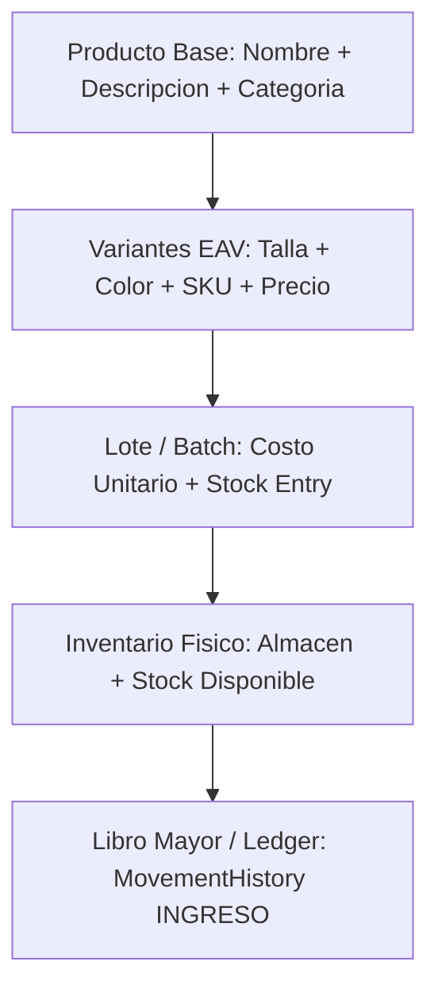

# 📦 Módulo 01: Inventario y Catálogo

Este módulo contiene toda la información necesaria para conectar tu Frontend o aplicación al sistema de inventario profesional del backend.

---

## 🏛️ Arquitectura del Inventario

El sistema está diseñado bajo una arquitectura de comercio electrónico con 4 componentes clave:

1. **Producto Base (`Product`)**: Información comercial general (nombre, descripción, categoría).
2. **Variantes (`ProductVariant` + `VariantDetail`)**: Sistema EAV para combinar Tallas (S, M, L, XL), Colores (Negro, Blanco, Rojo) y precios de venta.
3. **Lotes (`Batch`)**: Cada ingreso de mercadería se agrupa en un lote con su **costo unitario** (`unitCost`).
4. **Inventario por Ubicación (`CurrentInventory`)**: Control de `physicalQuantity` (físico) y `reservedQuantity` (reservado en carritos). Stock disponible = `physicalQuantity - reservedQuantity`.
5. **Libro Mayor Inmutable (`MovementHistory`)**: Auditoría de cada ingreso o salida.

---

## 📑 Documentos de esta Sección

- ➕ **[Crear Producto y Variantes (POST)](./crear-producto-y-variantes.md)**: Estructura JSON completa para dar de alta un producto con sus tallas, colores, lote y stock inicial en una sola petición.
- 🔍 **[Consultar Catálogo y Stock (GET)](./consultar-catalogo-y-stock.md)**: Cómo obtener el catálogo completo de productos con sus variantes y stock calculado.
- ⚙️ **[Auxiliares: Categorías, Atributos y Proveedores](./auxiliares-categorias-proveedores.md)**: Endpoints para cargar los selectores de tu interfaz frontend (Categorías, Tallas, Colores, Proveedores, Almacenes e Ingresos adicionales de stock).

---

[⬅️ Volver al Índice Principal de Documentación](../README.md)
