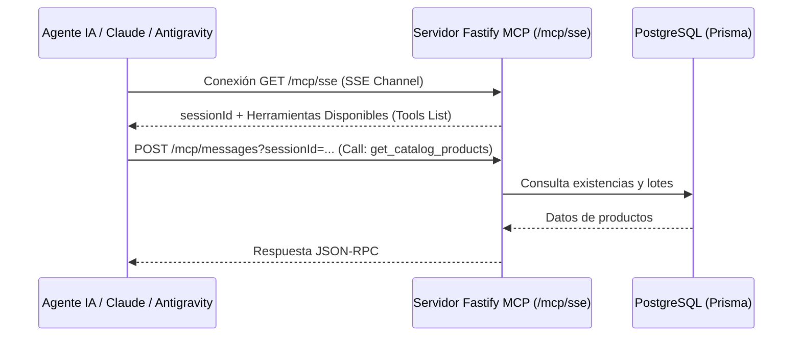

# 🤖 Módulo 02: Protocolo MCP (Model Context Protocol)

El protocolo **Model Context Protocol (MCP)** es el estándar de la industria creado por Anthropic para permitir que modelos de lenguaje (LLMs como Claude, Gemini, ChatGPT o agentes de Antigravity) exploren, consulten y auditen sistemas de datos de forma estandarizada y segura.

Tu backend incluye una implementación completa de servidor MCP mediante transporte **SSE (Server-Sent Events)** con `@modelcontextprotocol/sdk`.

---

## 🏗️ Flujo de Conexión MCP

---

## 📑 Documentos de esta Sección

- 🛠️ **[Herramientas MCP Expuestas](./herramientas-mcp.md)**: Lista detallada de las 3 herramientas de reporte que expone tu servidor (`get_catalog_products`, `get_users_report`, `get_orders_metrics`) y sus parámetros.
- ⚡ **[Conexión SSE y Endpoint Playground](./conexion-sse-y-playground.md)**: Cómo conectar clientes externos a `/mcp/sse` y cómo realizar consultas en lenguaje natural mediante el endpoint REST directo `POST /api/mcp/chat`.

---

[⬅️ Volver al Índice Principal de Documentación](../README.md)
