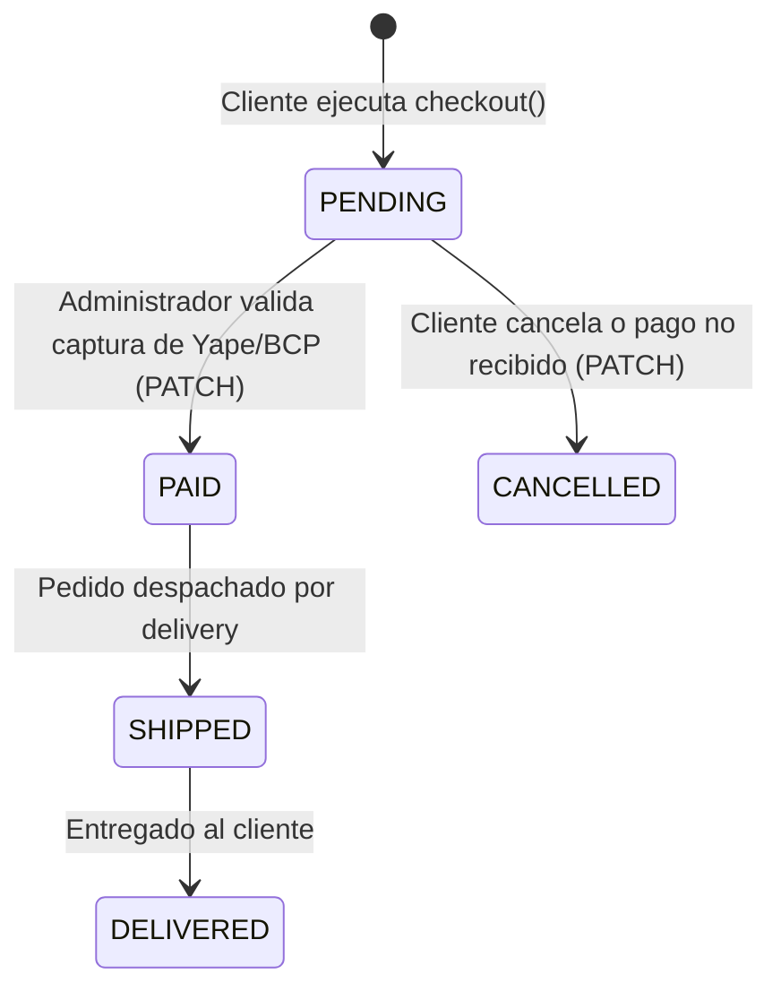

# 💸 Módulo 04: Órdenes, Pagos y Validación de Yape

Este módulo detalla cómo gestionar los pedidos generados por los clientes en WhatsApp, las métricas de ventas y el flujo para validar manualmente los comprobantes de pago de **Yape** y **BCP**.

---

## 🔄 Ciclo de Vida de una Orden

1. **Estado `PENDING` (Pendiente):** La orden se crea con el monto total en centavos. El stock de los lotes queda reservado / descontado en estrategia FIFO.
2. **Estado `PAID` (Pagado):** El asesor revisa el comprobante y confirma el pago mediante el endpoint `PATCH /api/admin/orders/:id/status`.
3. **Estado `CANCELLED` (Cancelado):** La orden se anula si no se recibe el pago.

---

## 📑 Documentos de esta Sección

- 📊 **[Consultar Órdenes y Métricas de Ventas](./consultar-ordenes.md)**: Cómo listar pedidos con filtros por estado (`PENDING`, `PAID`, `CANCELLED`), cliente y monto total.
- ✅ **[Validar Pagos y Actualizar Estado (PATCH)](./validar-pagos-y-estado.md)**: Contrato JSON para marcar una orden como pagada (`PAID`) o despachada (`SHIPPED`).

---

[⬅️ Volver al Índice Principal de Documentación](../README.md)
